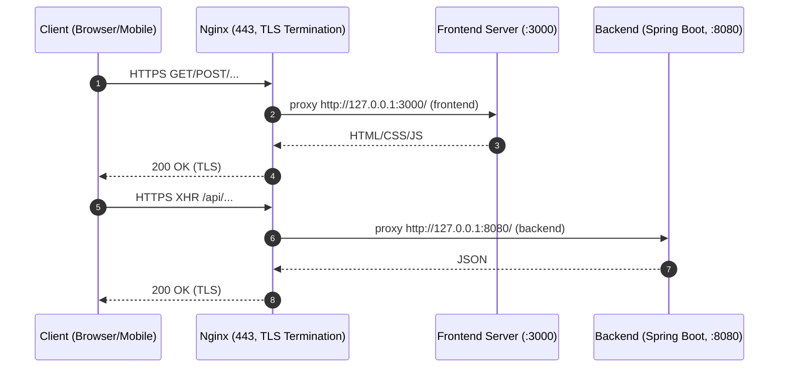

# 먹초이스 - 위치 기반 맛집 추천 서비스
https://mukchoice.kr

2025.06.01~ 2025.09.14

프로젝트 인원: 이보원

> **“내 위치와 그룹 친구들과 함께, 랜덤으로 즐기는 맛집 선택의 재미”**
> 
> 점심시간, 데이트, 친구와의 자리에서 뭘먹을지 고민될땐 먹초이스에게 선택을 맡겨보세요!
 

(모바일에서도 즐길 수 있습니다.)

---

## 프로젝트 개요
## 프로젝트 개요

**MukChoice는 회사에서 점심시간마다 동료들과 “오늘 뭐 먹지?”를 고민하던 경험에서 시작된 서비스입니다.**

짧은 점심시간 안에 모두의 취향을 맞추기 어렵고, 선택이 늘 반복된다는 문제를 해결하고자

위치 기반 맛집 추천과 그룹 단위 선택 기능을 중심으로 설계되었습니다.

사용자의 현재 위치를 기준으로 주변 맛집을 탐색하고,

개인 및 그룹의 위시리스트와 랜덤 추천 기능을 통해

의사결정 과정을 단순화하고 선택 자체를 즐거운 경험으로 만드는 것이 MukChoice의 목표입니다.

이 프로젝트는 단순한 아이디어 구현에 그치지 않고,

프론트엔드와 백엔드를 분리한 아키텍처, 인증/인가, 데이터 모델링,

그리고 Docker 기반 배포 및 운영 환경까지 고려하여 구현해 보았습니다.

---

## Backend
**Languages**

**Frameworks & ORM**

**Database**

**Build Tool**

**Auth**

**주요 기능**
- 사용자/위시리스트/그룹/맛집 데이터 관리 REST API
- OAuth 2.0 카카오 로그인 인증/인가
- JPA 기반 데이터 모델링 및 CRUD

---

## Frontend
**Core**

**State Management**

**Styling**

**Build Tool**

**External APIs**

**주요 기능**
- 그룹 관리: 생성/조회/상세 (최대 15개), 그룹장 권한, 멤버 초대, 카카오톡 초대
- 위치 기반: 현재 위치 기반 맛집 추천, 실시간 지도 마커 표시, 검색 및 선택
- 랜덤 추천: 셔플 애니메이션, 카드-지도 연동, 부드러운 트랜지션
- UI/UX: 반응형 모달, 로딩/에러 처리, 카드형 리스트, 직관적 버튼 인터랙션

---

## 기능 소개
### 로그인
빠르고 편리하게 카카오 소셜 로그인을 통해 계정을 관리합니다.

### 홈
2km 내 맛집을 검색할 수 있으며 카테고리별 1km 내 맛집을 탐방해보며 랜덤 초이스를 해보실 수 있습니다. 

**검색결과, 카테고리별 랜덤 초이스**

### 위시리스트
원하는 맛집을 위시리스트에 저장해두고, 랜덤 초이스로 즐겁게 선택하세요. 지역별 랜덤 초이스 기능도 지원합니다.

**전체 및 지역별 위시리스트 관리, 랜덤 초이스**

### 그룹
원하는 맛집을 그룹으로 관리해 보세요.

**그룹내 랜덤 초이스**

 
 

**그룹 초대**

카카오 공유하기를 통해 그룹에 초대하여 맛집을 공유할 수 있습니다.

### 마이페이지

마이페이지에서 소셜로그인 로그아웃이 가능합니다.

**로그아웃**

---

## 아키텍처

### 서비스 시스템 인프라 아키텍처

### 런타임 네트워크/포트 아키텍처

---

## 배포 및 운영
- 스크립트를 이용한 한번의 명령어로 로컬 빌드 → Docker Hub 푸시 → 서버에서 Pull & Compose 실행하여 배포.
- Backend/Frontend 컨테이너 분리
- Nginx Reverse Proxy로 라우팅
- MariaDB는 외부 서버 네이티브 설치

---

## 기술적 의의
- 서버 환경 구축 ~ 어플리케이션 배포 자동화까지의 경험.
- Kotlin + JPA/Hibernate 을 이용한 백엔드 구현.
- 프론트·백 분리 아키텍처 운영 경험
- OAuth 기반 인증/인가 직접 구현
- MobX + React Query 조합 활용
- Docker 기반 자동화 배포
- 위치 기반 서비스 + 랜덤 추천 경험

## 추후 개선 방향
- AI를 이용한 고도화
 - RAG 도입을 chat bot기능 개발
 - Langchain Agent 개발로 대화를 통한 action 수행 기능 개발 
